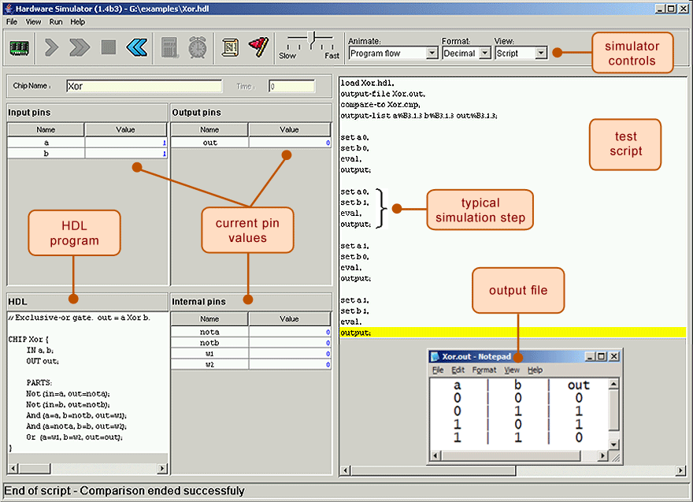

# Elementary Logic Gates

https://www.nand2tetris.org/project01

------

## Background

A typical computer architecture is based on a set of elementary logic gates like `And`, `Or`, `Mux`, etc., as well as their bit-wise versions `And16`, `Or16`, `Mux16`, etc. (assuming a 16-bit machine). This project engages you in the construction of a typical set of basic logic gates. These gates form the elementary building blocks from which more complex chips will be later constructed.

## Objective

Build all the logic gates described in *Chapter 1* (see list below), yielding a basic chip-set. The only building blocks that you can use in this project are primitive `Nand` gates and the composite gates that you will gradually build on top of them.

## Chips

|  Chip Name  |        Description         |  Test Scripts   |  Compare File   |
| :---------: | :------------------------: | :-------------: | :-------------: |
|   `Nand`    |  `Nand` gate (primitive)   |                 |                 |
|    `Not`    |         `Not` gate         |    `Not.tst`    |    `Not.cmp`    |
|    `And`    |         `And` gate         |    `And.tst`    |    `And.cmp`    |
|    `Or`     |         `Or` gate          |    `Or.tst`     |    `Or.cmp`     |
|    `Xor`    |         `Xor` gate         |    `Xor.tst`    |    `Xor.cmp`    |
|    `Mux`    |         `Mux` gate         |    `Mux.tst`    |    `Mux.cmp`    |
|   `DMux`    |        `DMux` gate         |   `DMux.tst`    |   `DMux.cmp`    |
|   `Not16`   |        16-bit `Not`        |   `Not16.tst`   |   `Not16.cmp`   |
|   `And16`   |        16-bit `And`        |   `And16.tst`   |   `And16.cmp`   |
|   `Or16`    |        16-bit `Or`         |   `Or16.tst`    |   `Or16.cmp`    |
|   `Mux16`   |     16-bit multiplexor     |   `Mux16.tst`   |   `Mux16.cmp`   |
|  `Or8Way`   |  `Or(in0, in1, ..., in7)`  |  `Or8Way.tst`   |  `Or8Way.cmp`   |
| `Mux4Way16` | 16-bit / 4-way multiplexor | `Mux4Way16.tst` | `Mux4Way16.cmp` |
| `Mux8Way16` | 16-bit / 8-way multiplexor | `Mux8Way16.tst` | `Mux8Way16.cmp` |
| `DMux4Way`  |    4-way demultiplexor     | `DMux4Way.tst`  | `DMux4Way.cmp`  |
| `DMux8Way`  |    8-way demultiplexor     | `DMux8Way.tst`  | `DMux8Way.cmp`  |

## Contract

When loaded into the supplied *Hardware Simulator*, your chip design (modified `.hdl` program), tested on the supplied `.tst` script, should produce the outputs listed in the supplied `.cmp` file. If that is not the case, the simulator will let you know. This contract must be satisfied for each chip listed above, except for the `Nand` chip, which is considered primitive, and thus there is no need to implement it.

## Resources

The relevant reading for this project is [*Chapter 1*](https://b1391bd6-da3d-477d-8c01-38cdf774495a.filesusr.com/ugd/44046b_f2c9e41f0b204a34ab78be0ae4953128.pdf) and [*Appendix A*](https://b1391bd6-da3d-477d-8c01-38cdf774495a.filesusr.com/ugd/44046b_2cc5aac034ae49f4bf1650a3d31df32c.pdf). Specifically, all the chips described in *Chapter 1* should be implemented in the Hardware Description Language (HDL) specified in *Appendix A*. Another resource that you will find handy in this and in all subsequent hardware projects is this [*HDL Survival Guide*](https://www.nand2tetris.org/hdl-survival-guide), written by *Mark Armbrust*.

For each chip, we supply a skeletal `.hdl` file with a place holder for a missing implementation part. In addition, for each chip we supply a `.tst` script that instructs the hardware simulator how to test it, and a `.cmp` ("*compare file*") containing the correct output that this test should generate. Your job is to complete and test the supplied skeletal `.hdl` files.

If you've downloaded the *Nand2Tetris* Software Suite (from the *Software* section of this website), you will find the supplied *Hardware Simulator* and all the necessary project files in the `nand2tetris/tools` directory and in the `nand2tetris/projects/01` directory, respectively. To get acquainted with the *Hardware Siumlator*, you can review *parts I-II-III* of the supplied *Hardware Simulator Tutorial*.

## Tips

**Prerequisite:** If you haven't done it yet, download the *Nand2Tetris* Software Suite from the *Software* section of this website to your computer. Read *Chapter 1* and *Appendix A*, and go through *parts I-II-III* of the *Hardware Simulator*, before starting to work on this project.

**Built-in chips:** The `Nand` gate is considered primitive and thus there is no need to implement it: whenever a `Nand` chip-part is encountered in your HDL code, the simulator automatically invokes the built-in `tools/builtInChips/Nand.hdl` implementation. We recommend implementing all the other gates in this project in the order in which they appear in *Chapter 1*. However, note that the supplied hardware simulator features built-in implementations of all these chips. Therefore, you can use any one of these chips before implementing it: the simulator will automatically invoke their built-in versions.

For example, consider the supplied skeletal `Mux.hdl` program. Suppose that for one reason or another you did not complete the implementation of `Mux`, but you still want to use `Mux` chips as internal parts in other chip designs. You can easily do so, thanks to the following convention. If the simulator fails to find a `Mux.hdl` file in the current directory, it automatically invokes the built-in `Mux` implementation, which is part of the supplied simulator's environment. This built-in `Mux` implementation has the same interface and functionality as those of the `Mux` chip described in the book. Thus, if you want the simulator to ignore one or more of your chip implementations, simply rename the corresponding `chiPname.hdl` file, or remove it from the directory. When you are ready to develop this chip in HDL, put the file `chipName.hdl` back in the directory, and proceed to edit it with your HDL code.

## Tools

All the chips mentioned *projects 1-5* can be implemented and tested using the supplied *Hardware Simulator*. Here is a screen shot of testing a `Xor.hdl` chip implementation on the *Hardware Simulator*:

------

*© 2017 Shimon Schocken and Noam Nisan*