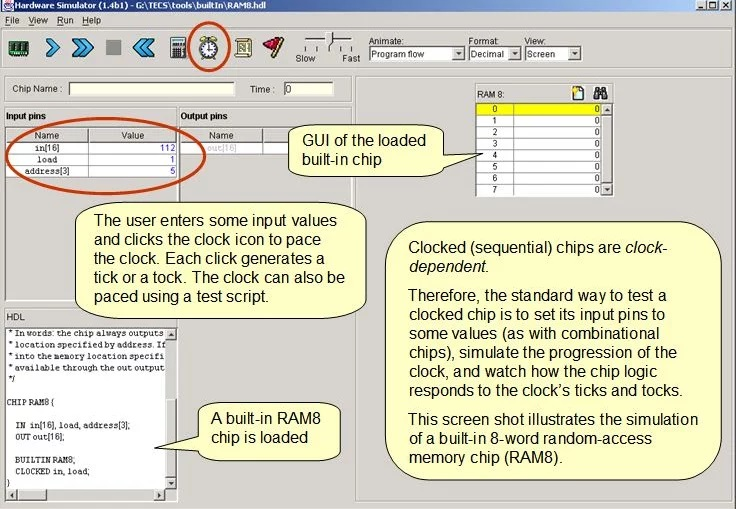

# Sequential Chips

https://www.nand2tetris.org/project03

------

## Background

The computer's main memory, also called Random Access Memory, or RAM, is an addressable sequence of *n*-bit registers, each designed to hold an *n*-bit value. In this project you will gradually build a RAM unit. This involves two main issues:

- how to use gate logic to store bits persistently, over time.
- how to use gate logic to locate ("address") the memory register on which we wish to operate.

## Objective

Build all the chips described in *Chapter 3* (see list below), leading up to a Random Access Memory (RAM) unit. The only building blocks that you can use are primitive `DFF` gates, chips that you will build on top of them, and chips described in previous chapters.

## Chips

| Chip Name  |          Description           |  Test Scripts  |  Compare File  |
| :--------: | :----------------------------: | :------------: | :------------: |
|   `DFF`    |   Data Flip-Flop (primitive)   |                |                |
|   `Bit`    |         1-bit register         |   `Bit.tst`    |   `Bit.cmp`    |
| `Register` |        16-bit register         | `Register.tst` | `Register.cmp` |
|   `RAM8`   |   16-bit / 8-register memory   |   `RAM8.tst`   |   `RAM8.cmp`   |
|  `RAM64`   |   6-bit / 64-register memory   |  `RAM64.tst`   |  `RAM64.cmp`   |
|  `RAM512`  |  16-bit / 512-register memory  |  `RAM512.tst`  |  `RAM512.cmp`  |
|  `RAM4K`   | 16-bit / 4096-register memory  |  `RAM4K.tst`   |  `RAM4K.cmp`   |
|  `RAM16K`  | 16-bit / 16384-register memory |  `RAM16K.tst`  |  `RAM16K.cmp`  |
|    `PC`    |     16-bit program counter     |    `PC.tst`    |    `PC.cmp`    |

## Contract

When loaded into the supplied *Hardware Simulator*, your chip design (modified `.hdl` program), tested on the supplied `.tst` script, should produce the outputs listed in the supplied `.cmp` file. If that is not the case, the simulator will let you know. This contract must be satisfied for each chip listed above, except for the `DFF` chip, which is considered primitive, and thus there is no need to implement it.

## Resources

The relevant reading for this project is *Chapter 3* and *Appendix A*. Specifically, all the chips described in *Chapter 3* should be implemented in the Hardware Description Language (HDL) specified in *Appendix A*.

For each chip, we supply a skeletal `.hdl` file with a missing implementation part. In addition, for each chip we supply a `.tst` script that instructs the hardware simulator how to test it, and a `.cmp` ("compare file") containing the correct output that this test should generate. Your job is to complete and test the supplied skeletal `.hdl` files.

The resources that you need for this project are the supplied *Hardware Simulator* and the files listed above. If you've downloaded the *Nand2Tstris* Software Suite, these files are stored in your `projects/03` directory. The directory is further partitioned into two sub-directories, for reasons described below.

## Tips

The **Data Flip-Flop (DFF) gate** is considered primitive and thus there is no need to build it: when the simulator encounters a `DFF` chip part in an HDL program, it automatically invokes the built-in `nand2tetris/tools/builtInChips/DFF.hdl` implementation.

**Built-in chips:** When constructing RAM chips from lower-level RAM chip-parts, we recommend using built-in versions of the latter. Otherwise, the simulator will recursively generate numerous memory-resident software objects, one for each one of the many chip parts that make up a typical RAM unit. This may cause the simulator to run slowly, or, worse, out of memory. i.e. out of the memory of the computer on which the simulator is running. 

To avert this problem, we've partitioned the RAM chips that you have to build in this project into two sub-directories, named `projects/03/a` and `projects/03/b`. This partition is superficial, and is done with one purpose only: when building the chips stored in `b`, the simulator is forced to use built-in implementations of the lower-level chip parts whose `.hdl` programs are stored in `a` but not in `b`.

## Tools

All the chips mentioned *Projects 0-5* can be implemented and tested using the supplied *Hardware Simulator*. Here is a screen shot of testing a built-in `RAM8.hdl` chip implementation on the *Hardware Simulator*:

------

*© 2017 Shimon Schocken and Noam Nisan*