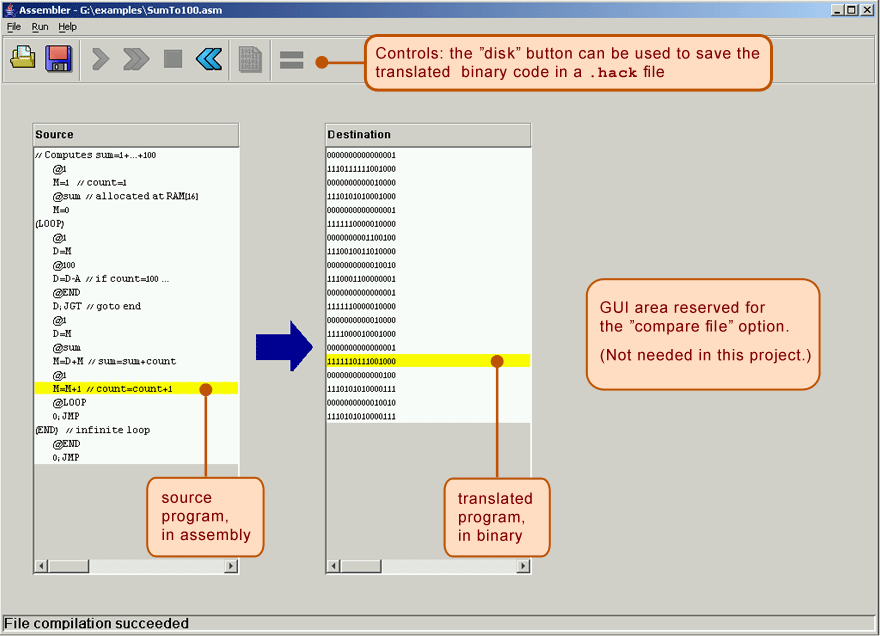

# Machine Language Programming

https://www.nand2tetris.org/project04

------

## Background

Every hardware platform is designed to execute commands in a certain machine language, expressed using agreed-upon binary codes. Writing programs directly in binary code is a possible, yet unnecessary. Instead, we can write such programs using a low-level symbolic language, called *assembly*, and have them translated into binary code by a program called *assembler*. In this project you will write some low-level assembly programs, and will be forever thankful for high-level languages like Java and Python. (Actually, assembly programming can be highly rewarding, allowing direct and complete control of the underlying machine.)

## Objective

To get a taste of low-level programming in machine language, and to get acquainted with the *Hack* computer platform. In the process of working on this project, you will become familiar with the assembly process - translating from symbolic language to machine-language - and you will appreciate visually how native binary code executes on the target hardware platform. These lessons will be learned in the context of writing and testing two low-level programs, as follows.

## Programs

- `Mult.asm`

  - **Description**

    **Multiplication:** in the *Hack* computer, the top 16 RAM words (`RAM[0]`...`RAM[15]`) are also referred to as `R0`...`R15`.

    With this terminology in mind, this program computes the value `R0` * `R1` and stores the result in `R2`.

    The program assumes that `R0` >= 0, `R1` >= 0, and `R0` * `R1` < 32768. Your program need not test these conditions, but rather assume that they hold.

  - **Guidelines / Tests**

    1. Use a plain text editor to write your `Mult.asm` program using the *Hack* assembly language.

    2. Use the supplied *Hack Assembler* to translate your `Mult.asm` program, producing a `Mult.hack` file containing binary *Hack* instructions.

    3. Next, load the supplied `Mult.tst` script into the *CPU Emulator*. This script loads the `Mult.hack` program, and executes it.

    
    4. Run the script. If you get any errors, debug and edit your `Mult.asm` program. Then assemble the program, re-run the `Mult.txt` script, etc.

- `Fill.asm`

  - **Description**

    **I/O handling:** this program illustrates low-level handling of the screen and keyboard devices, as follows.

    The program runs an infinite loop that listens to the keyboard input. When a key is pressed (any key), the program blackens the screen, i.e. writes "*black*" in every pixel; the screen should remain fully black as long as the key is pressed.

    When no key is pressed, the program clears the screen, i.e. writes "*white*" in every pixel; the screen should remain fully clear as long as no key is pressed.

    **Implementation note:** your program may blacken and clear the screen's pixels in any spatial/visual order, as long as pressing a key continuously for long enough results in a fully blackened screen, and not pressing any key for long enough results in a fully cleared screen.

  - **Guidelines / Tests**

    Write, test, and debug your `Fill.asm` program by following the same guidelines given above for the `Mult` program.

    The supplied `Fill.tst` script, which comes with no compare file, is designed to do two things:

    - Load the `Fill.hack` program.
    - Remind you to select '*no animation*', and then test the program interactively by pressing and releasing some keyboard keys.
    
    The supplied `FillAutomatic.tst` script, along with the supplied compare file `FillAutomatic.cmp`, are designed to test the `Fill` program automatically, as described by the test script documentation.
    
    For completeness of testing, it is recommended to test the `Fill` program both interactively and automatically.

## Contract

Write and test the two programs described above. When executed on the supplied *CPU Emulator*, your programs should generate the results mandated by the specified tests.

## Resources

The *Hack* assembly language is described in detail in *Chapter 4*.

You will need two tools:

- The supplied *Assembler* - a program that translates programs written in the *Hack* assembly language into binary *Hack* code.
- The supplied *CPU Emulator* - a program that runs binary *Hack* code on a simulated *Hack* platform. 

Assuming that you've downloaded the *Nand2Tetris* Software Suite, the *Assembler* and the *CPU Emulator* should be available in the `nand2tetris/tools` folder on your computer.

Two other related and useful resources are the supplied *Assembler Tutorial* and *CPU Emulator Tutorial*.

We recommend going through these tutorials before starting to work on this project.

Finally, assuming that you've downloaded the *Nand2Tetris* Software Suite, all the project materials should be available in your `nand2tetris/projects/04` folder.

## Proposed Implementation

1. Use a plain text editor to write the first assembly program. Start by loading and editing the supplied `projects/04/mult/Mult.asm` file.
2. Use the supplied assembler (in either batch or interactive mode) to translate your program. If you get syntax errors, go to *Step 1*; if there are no syntax errors, the assembler will generate a file named `projects/04/mult/Mult.hack`, containing binary instructions written in the *Hack* machine language.
3. Use the supplied *CPU Emulator* to load, and then test, the translated `Mult.hack` code. This can be done either interactively, or batch-style, using the supplied `Mult.tst` script. If you get run-time errors, go to
   *Step 1*.
4. Repeat *Stages 1-3* for the second program (`Fill.asm`), working in the `projects/04/fill` folder.

**Debugging tip:** The *Hack* language is case-sensitive. A common error occurs when one writes, say, `@foo` and `@Foo` in different parts of one's program, thinking that both labels are treated as the same symbol. In fact, the assembler treats them as two different symbols. This bug is difficult to detect, so you should be aware of it.

## Tools

The supplied ***Hack Assembler*** can be used in either command mode (from the command shell), or interactively. The latter mode of operation allows observing the translation process in a visual and step-wise fashion, as shown below:

The machine language programs produced by the assembler can be tested in two different ways. First, one can run the resulting `.hack` program in the supplied *CPU Emulator*. Alternatively, one can run the same program directly on the *Hack* hardware, using the supplied *Hardware Simulator* used in *Projects 1-3*. To do so, one can load the `Computer.hdl` chip (built in *Project 5*) into the *Hardware Simulator*, and then proceed to load the binary code (from the `.hack` file) into the computer's Instruction Memory (also called ROM). Since we will complete building the hardware platform and the `Computer.hdl` chip only in the next project, at this stage we recommend testing machine-level programs using the supplied *CPU Emulator*.

The supplied ***CPU Emulator*** includes a ROM (also called Instruction Memory) representation, into which the binary code is loaded, and a RAM representation, which holds data. For ease of use, the emulator enables the user to view the loaded ROM-resident code in either binary mode, or in symbolic/assembly mode. In fact, the *CPU Emulator* even allows loading symbolic code written in assembly directly into the ROM, in which case the emulator translates the loaded code into binary code on the fly. This utility seems to render the supplied assembler unnecessary, but this is not the case. First, the supplied assembler shows the translation process visually, for instructive purposes. Second, the assembler generates a persistent binary file. This file can be executed either on the *CPU Emulator*, as we illustrate below, or directly on the hardware platform, as we'll do in the next project.

------

*© 2017 Shimon Schocken and Noam Nisan*