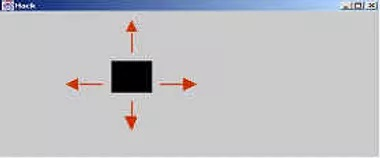

# High-Level Programming

https://www.nand2tetris.org/project09

------

## Background

This project introduces *Jack* - a simple, Java-like, object-based programming language. Before building a *Jack* compiler in *Projects 10-11*, it makes sense to become familiar with the language itself. That's what we'll do in this project.

## Objective

Adopt or invent an application idea like a simple computer game or some other interactive program. Examples include *Tetris*, *Snake*, *Space Invaders*, *Sokoban*, *Pong*, etc. Your job is to implement this application in *Jack*.

## The Jack OS

Writing *Jack* programs requires working with the *Jack OS*, just like writing Java programs requires working with the Java class library. The *Jack OS* can be viewed as a collection of software services that extend the basic language's capabilities and close gaps between it and the underlying hardware. For example, if you wish to compute and print the square root of a user-supplied number, you can write *Jack* statements like let `x = Keyboard.readInt(”Enter a number: ”);` followed by `let y = Math.sqrt(x);` followed by `do Output.printInt(y);` (you can achieve the same result using a single *Jack* statement, and no variables).

In the above example, the functions `readInt`, `sqrt`, and `printInt` are parts of, respectively, the *Jack OS* classes `Keyboard`, `Math`, and `Output`. The *Jack OS* includes 8 such classes: the 3 just mentioned, as well as `Screen`, `Memory`, `String`, `Array`, and `Sys`.

You can read *Jack OS API*.

The *Nand2tetris* Software Suite includes two *Jack OS* implementations:

- One OS implementation was written by *Yaron Ukrainitz* in the *Jack* language, and was then translated using a *Jack* compiler into the set of 8 class files `Math.vm`, `Screen.vm`, `Output.vm`, `Keyboard.vm`, `Memory.vm`, `String.vm`, `Array.vm`, and `Sys.vm`. These files are stored in the `nand2tetris/tools/os` directory in your computer.
- The second OS implementation was written by *Yannai Gunczarowski* in Java, and is now an integral part of the supplied *VM Emulator*, also available in your `nand2tetris/tools` directory.

Below we explain how to use each OS version.

## Writing and Editing Jack Programs

A *Jack* application is a collection of one or more `.jack` files. You can write and edit these files in any text editor that handles plain text files. For example, if you wish to use *Notepad++*, you can follow these steps:

- Install the latest version of *Notepad++* on your computer;
- Copy *Jack Syntax Conventions* to the file `\notepad++\userDefineLang.xml` on your computer.

This action will customize *Notepad++* for writing *Jack* programs on your computer. Of course you are welcome to use any other text editor that suites you. If you wish to customize the editor for *Jack* programming (not an essential tweak, really), you will have to figure out yourself how to do it.

It is perhaps worthy to note that we don't want to make a big deal out of *Jack* programming. We use *Jack* mainly as a means for learning how to develop simple compilers and operating systems, as we'll do in *Projects 10*, *11*, and *12*. Therefore, there is no need to spend too much time honing your *Jack* programming skills.

## Resources

The relevant reading for this project is book *Chapter 9*. You will need three tools:

- A text editor for writing your *Jack* programs.
- The supplied *Jack Compiler* for compiling them.
- The supplied *VM Emulator* for executing and testing them.

The document *Jack OS Error Codes* may come handy during your program development process.

## Sample Jack Program

**Square Dance:** this simple interactive program allows the user to move a graphical square around the screen:

The user can also control the square's size.

The program's handling of the keyboard and the screen illustrates programming practices that are applicable to developing interactive *Jack* applications in general. Therefore, it is recommended to explore the program's code, which is given below.

When the program starts running, a square of size 30 by 30 pixels pops up at the top-left corner of the screen. The program then listens, and responds, to the following key-pressing events:

- **right-arrow**

  Moves the square to the right.

- **left-arrow**

  Moves the square to the left.

- **up-arrow**

  Moves the square up.

- **down-arrow**

  Moves the square down.

- **x**

  Increments the square's size by 2 pixels.

- **z**

  Decrements the square size by 2 pixels.

- **q**

  Quits the program.

**Animation speed:** can be controlled by changing the delay constant in the `moveSquare` method in the `SquareGame.jack` class source code.

The source code of this *Jack* program is available in your `nand2tetris/projects/09/Square` directory.

|       Class       |                         Description                          |
| :---------------: | :----------------------------------------------------------: |
|    `Main.jack`    |          Initializes and starts a new game session.          |
|   `Square.jack`   | Implements a graphical square. A Square object has size and screen location properties, and methods for drawing, erasing, moving, and size changing. |
| `SquareGame.jack` |          Runs the game according to the game rules.          |

## Compiling and Running a Jack Application

1. Create a directory, say `MyApp`.
2. Write your application - a set of one or more `.jack` files, and store them in the `MyApp` directory.
3. If you wish to use the compiled OS version (set of 8 `.vm` files), copy these `.vm` files from the `nand2tetris/tools/os` directory into your `MyApp` directory. If you wish to use the OS version which is built into the *VM Emulator*, this step is not necessary.
4. Use the supplied *Jack Compiler* to compile the `MyApp` directory. The compiler will translate all the `.jack` classes found in the given directory into corresponding `.vm` files. If the compiler complains about errors, debug the relevant class file and re-compile `MyApp` until there are no errors.
5. To test your program, load the entire `MyApp` directory into the supplied *VM Emulator*. Then run and test the program. Any problems? debug a recompile.

Which OS version to use is up to you. The built-in version is faster. The *VM Emulator* does not care which OS version is used, for the following reason.

Suppose you've loaded a directory into the *VM Emulator*, and proceeded to execute it. Whenever the emulator detects a call for some `OSclass.function`, it checks if this function is available in the loaded code base; if so, it executes this function's VM code; otherwise, it reverts to using the built-in implementation of this OS function. Therefore, you are welcome to use all, or some, or none of the compiled OS class files, as you see fit. This flexibility will be quite a boon when we'll develop and unit-test the *Jack OS* in *Project 12*.

------

*© 2017 Shimon Schocken and Noam Nisan*