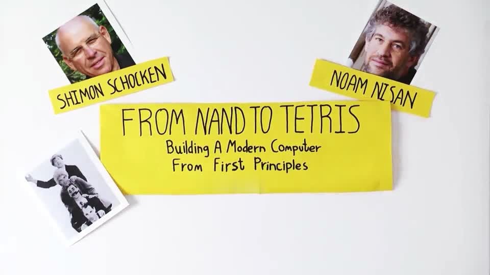

# "From Nand To Tetris" Projects on Coursera

## Contents

### Part 1

[Week 1 - Elementary Logic Gates](https://github.com/czs108/Coursera-From-Nand-To-Tetris-Projects/tree/master/Project-1%20Elementary%20Logic%20Gates)

[Week 2 - Combinational Chips](https://github.com/czs108/Coursera-From-Nand-To-Tetris-Projects/tree/master/Project-2%20Combinational%20Chips)

[Week 3 - Sequential Chips](https://github.com/czs108/Coursera-From-Nand-To-Tetris-Projects/tree/master/Project-3%20Sequential%20Chips)

[Week 4 - Machine Language Programming](https://github.com/czs108/Coursera-From-Nand-To-Tetris-Projects/tree/master/Project-4%20Machine%20Language%20Programming)

[Week 5 - Computer Architecture](https://github.com/czs108/Coursera-From-Nand-To-Tetris-Projects/tree/master/Project-5%20Computer%20Architecture)

[Week 6 - The Assembler](https://github.com/czs108/Coursera-From-Nand-To-Tetris-Projects/tree/master/Project-6%20The%20Assembler)

### Part 2

[Week 1 - Virtual Machine I - Stack Arithmetic](https://github.com/czs108/Coursera-From-Nand-To-Tetris-Projects/tree/master/Project-7%20Virtual%20Machine%20I%20-%20Stack%20Arithmetic)

[Week 2 - Virtual Machine II - Program Control](https://github.com/czs108/Coursera-From-Nand-To-Tetris-Projects/tree/master/Project-8%20Virtual%20Machine%20II%20-%20Program%20Control)

[Week 3 - High-Level Programming](https://github.com/czs108/Coursera-From-Nand-To-Tetris-Projects/tree/master/Project-9%20High-Level%20Programming)

[Week 4 - Compiler I - Syntax Analysis](https://github.com/czs108/Coursera-From-Nand-To-Tetris-Projects/tree/master/Project-10%20Compiler%20I%20-%20Syntax%20Analysis)

[Week 5 - Compiler II - Code Generation](https://github.com/czs108/Coursera-From-Nand-To-Tetris-Projects/tree/master/Project-11%20Compiler%20II%20-%20Code%20Generation)

[Week 6 - The Operating System](https://github.com/czs108/Coursera-From-Nand-To-Tetris-Projects/tree/master/Project-12%20The%20Operating%20System)

## Course Website

https://www.coursera.org/learn/build-a-computer/

https://www.coursera.org/learn/nand2tetris2/

## Warning

> Do **NOT** post solutions publicly on the web like blogs, forums, or GitHub-like places.

## Contact

***GitHub:*** https://github.com/czs108/

***E-Mail:*** chenzs108@outlook.com

***WeChat:*** chenzs108