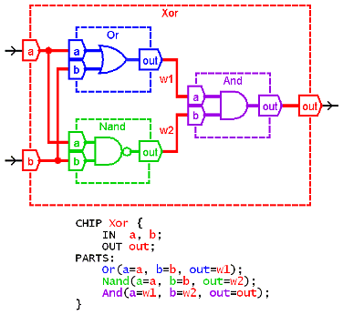

# HDL Survival Guide

**by *Mark Armbrust***

------

This guide is designed to help you understand and write HDL programs in the context of *Nand2Tetris* courses. It was written in order to answer recurring issues that came up in many posts in the Q&A forum of the *nand2tetris* web site. These posts were made by people who worked on the course's hardware projects and got stuck for one reason or another.

## Terminology

Throughout this document, we use the terms "*HDL file*", "*HDL program*", and "*HDL implementation*" interchangeably. Likewise, we use the terms "*build a chip*", "*construct a chip*", and "*implement a chip*" interchangeably. The term "*HDL file stub*" refers to a file that contains the HDL definition of a chip interface. That is, a stub file contains the chip name and the names of all the chip's input and output pins, without the chip's implementation, also known as the `PARTS` section of the HDL program. A stub file also contains the chip's documentation — a succinct description of what the chip is supposed to do. 

## Project Files

If you've downloaded the *nand2tetris* software, then there are now 13 directories (folders) on your computer, named `projects/01` ..., `projects/13`. Each directory contains all the files necessary to complete the respective project. The projects themselves are described in the **Course** page of the *nand2tetris* web site. *Projects 1-5* focus on building the hardware platform of the *Hack* computer. Each project walks you through the construction of a certain subset of the *Hack* chip-set. The directory (folder) that accompanies each project contains stub HDL files for all the chips you need to build, as well as all the test scripts required to test your HDL implementations .The "only" thing that you have to do is extend the supplied stub HDL files into working chip implementations, i.e. chips that run in the supplied hardware simulator and successfully pass all the tests listed in the supplied test scripts.

Other useful resources to help you complete the projects are the lecture slides given in the "*Lecture*" column of the **Course** page, as well as the relevant book chapters.

## Chip Implementation Order

Each project directory contains a set of HDL stub files, one for each chip that you have to build. It's important to understand that all the supplied HDL files contain no implementations (building these implementations is what the project is all about). For example, consider the construction of a `Xor` chip. If your `Xor.hdl` program will include, say, `And` and `Or` chip-parts, and you have not yet implemented the `And` and `Or` chips, your tests will fail even if your `Xor` implementation is correct.

Note however that if the project directory included no `And.hdl` and `Or.hdl` files at all, your `Xor.hdl` program will work properly. This sounds surprising, so here is the explanation. The hardware simulator, which is a Java program, features working Java implementations of all the chips necessary to build the Hack computer. When the simulator has to execute the logic of some chip-part, say `And`, taken from the *Hack* chip-set, it looks for an `And.hdl` file in the current project directory. At this point there are three possibilities:

- No HDL file is found. In this case, the Java implementation of the chip kicks in and "covers" for the missing HDL implementation.
- A stub HDL file is found. The simulator tries to execute it. But since a stub file contains no implementation, the execution fails.
- A "*normal*" HDL file is found. The simulator executes it, reporting errors to the best of its ability.

Therefore, to avoid chip order implementation troubles, you can do one of two things. First, you can implement your chips in the order presented in the book and in the project descriptions. Since the chips are presented "*bottom-up*", from basic chips to more complex ones, you will encounter no chip order implementation troubles.

A recommended alternative is to create a subdirectory called "*stubs*" and move all the supplied HDL stub files into that directory. You can then move them into your working directory as needed.

Note that the `.hdl` file that you are working on and its associated `.tst` file must be in the same directory. If you will look at the header code of the supplied test script, you will see that it includes a command that loads the HDL file that it is supposed to test from the same working directory. Thus, if you load your HDL file into the simulator and then load the test script from a different directory, the test script will load and test a different HDL file. Proper usage is to load into the simulator either an `.hdl` file or a `.tst` file, not both.

## HDL syntax and the meaning of `"a=a"`

HDL statements are used to describe how chip-parts are connected to each other, as well as to the input and output pins of the constructed chip. The syntax of these statements can be confusing, especially when pin names like `in`, `out`, `a` and `b` are used both by the chip-parts as well as by the constructed chip. This leads to statements like `And(a=a, b=b, out=r)`. This particular statement instructs to:

1. connect the `a` and `b` input pins of the `And` chip-part to the `a` and `b` input pins of the constructed chip.
2. create an internal pin ("*wire*") named `r`.
3. connect the output pin of the `And` chip-part to `r`.

Here is a simple rule that helps sort things out: the symbol on the left hand side of each `=` symbol is always the name of a pin in a chip-part, and the symbol on the right hand side is always the name of a pin or a wire in the constructed chip (the chip that you are building).

The following figure shows a diagram and HDL code of a `Xor` chip. The diagram uses color coding to highlight which symbols "belong" to which chips. (Note that there are several different ways to implement `Xor`; this is just one of them.)



## HDL Syntax Errors

The hardware simulator displays errors on the status bar at the bottom of its window. On some computers with small screens these messages are off the bottom of the screen and are not visible. If you load your HDL and nothing show up in the HDL window in the simulator and you don't see an error message, this is probably what's happening.

Your computer should have a way to move the window to see the message using the keyboard. For example, on Windows use <kbd>Alt</kbd> + <kbd>Space</kbd>, <kbd>M</kbd>, and the arrow keys.

## Unconnected Pins

The *Hardware Simulator* does not consider unconnected pins to be errors. It defaults any unconnected input or output to be `false` (0). This can cause mysterious errors in your chip implementations.

If the output of your chip is always 0, make sure that your chip's output pin is connected to the output pin of one of the chip-parts you are using. Double-check the names of the wires involved in the chip's output. Typographic errors are particularly bad here since the simulator doesn't throw errors on disconnected wires. For example, if you write `SomeChip(..., sum=sun);` the simulator will happily make a wire named "*sun*" and your chip's output will always be 0 (because, quite likely, the `sun` pin will not be connected to any other chip-part in your implementation, so nothing will be piped further from `SomeChip` onward).

If the output of a chip-part in your implementation does not appear to be working correctly, check that all of its input pins are connected to something.

For a complete list of all the chips that you need in all the hardware projects, see the *Hack* Chip-Set API at the end of this document.

## Canonical Representation

The book introduces you to the canonical representation of a Boolean function. This representation can be very useful for chips with small numbers of inputs. As the number of inputs grows, the complexity of the canonical representation grows exponentially.

For example, the canonical representation of `Mux` has 4 three-variable terms; that of a `Mux8Way` would have 1024 11-variable terms. Large canonical representations can be reduced with algebra, usually by computer programs. In the case of `Mux8Way` it can be reduced to 8 four-input terms.

Clearly, this is not a practical approach for *nand2tetris*. You need to think about how to use the chips you have already made to make the next chip (assuming you're following the recommended order). The projects are organized in such a way that often you need the chip that you have just made.

## Tests Are More Than Pass/Fail

For every `chip.hdl` file, your working directory also includes a test script, named `chip.tst`, and a compare file, named `chip.cmp`. Once your chip starts generating outputs, your directory will also include an output file named `chip.out`. When your chip fails the test script, don't forget to consult the `.out` file. Inspect the listed output values, and seek clues to the failure. If you can't see the output file in the simulator environment (reported bug on some Macs), you can look at it in a text editor.

If you need to, you can copy the `chip.tst` file to `myChip.tst` and change it to give you more information about the behavior of your chip. Change the output file name in the `output-file` line and delete the `compare-to` line. This will cause the test to always run to completion.

You can also modify the `output-list` line to show the outputs of your internal wires. The output format specifier is fairly obvious. The format letters are `B` for binary, `D` for decimal, and `X` for hexadecimal.

## Testing A Chip In Isolation

At some point you may become convinced that your chip is correct, but it is still failing the test. The problem may be with one of the chip-parts used in your chip implementation.

You can diagnose which chip-part is causing the problem as follows. Create a test subdirectory and copy into it only the three `.hdl`, `.tst`, and `.out` files related to the chip that you are building. If your chip implementation passes its test in this subdirectory as-is (letting the simulator use the default Java implementation of the missing chip-parts), there must be a subtle problem with one of your chip-parts implementations, i.e. with one of the chips that you've built earlier in this project. Copy your other chips into this test directory one by one, repeating the test, until you find the problematic chip.

Note also that the supplied tests, especially for more complex chips, cannot guarantee that the tested chips are 100% correct.

## HDL Is Not A Programming Language

Go back to one of your chips that uses 3 or 4 parts. Reverse the order of the HDL statements that describe some of the chip-parts. *Will the chip still work?* You may be surprised that the answer is *yes*.

The reason that the chip still works is that HDL is a hardware *description* language (also known as a "*declarative*" language). It describes the wiring connections that are needed to make the chip, not how it operates once power is applied. It makes no difference what order the parts are put into a circuit board. As long as all the parts get placed and connected together correctly, the circuit board will function.

The *Hardware Simulator* "applies the power" and tests how the chip functions.

An important aspect of this is that there is no such thing as an "*uninitialized variable*" in HDL. If a wire is connected to an output somewhere in the HDL, it can be connected to any input. This is particularly important to understand for *Chapter 3*.

## Bit Numbering and Bus Syntax

Hardware bits are numbered from right to left, starting with 0. When a bus is carrying a number, bit *n* is the bit with weight 2<sup>*n*</sup>. 

For example, when the book says `sel` = 110, it means that a bus named `sel` receives the inputs `110`. That means `sel[2]` = 1, `sel[1]` = 1 and `sel[0]` = 0. Read *Appendix A.5.3* in the book to learn about bus syntax.

## Sub-busing

Sub-busing can only be used on buses that are named in the `IN` and `OUT` statements of an HDL file, or inputs and outputs of the chip-parts used in the `PARTS` section. If you need a sub-bus of an internal bus, you must create the narrower bus as an output from a chip-part. For example:

```vhdl
CHIP Foo {
    IN in[16];
    OUT out;
	PARTS:
        Something16 (in=in, out=notIn);
        Or8Way (in=notIn[4..11], out=out);
}
```

This implementation causes an error on the `Or8Way` statement. This needs to be coded as:

```vhdl
Something16(in=in, out[4..11]=notIn);
Or8Way(in=notIn, out=out);
```

## Multiple Outputs

Sometimes you need more than one sub-bus connected to the output of a chip-part. Simply add more than one `out=` connection to the chip-part definition.

```vhdl
CHIP Foo {
    IN in[16];
    OUT out[8];
    PARTS:
        Not16 (in=in, out[0..7]=low8, out[8..15]=high8);
        Something8 (a=low8, b=high8, out=out);
}
```

This also works if you want to use an output of a chip in further computations.

```vhdl
CHIP Foo {
	IN a, b, c;
	OUT out1, out2;
	PARTS:
	   Something (a=a, b=b, out=x, out=out1);
	   Whatever (a=x, b=c, out=out2);
}
```

## The Hack chip-set API

Below is a list of all the chip interfaces in the *Hack* chip-set, prepared by *Warren Toomey*. If you need to use a chip-part, you can copy-paste the chip interface and proceed to fill in the missing data. This is a very useful list to have bookmarked or printed.

```vhdl
Add16(a= ,b= ,out= ); 
ALU(x= ,y= ,zx= ,nx= ,zy= ,ny= ,f= ,no= ,out= ,zr= ,ng= ); 
And16(a= ,b= ,out= ); 
And(a= ,b= ,out= ); 
ARegister(in= ,load= ,out= ); 
Bit(in= ,load= ,out= ); 
CPU(inM= ,instruction= ,reset= ,outM= ,writeM= ,addressM= ,pc= ); 
DFF(in= ,out= ); 
DMux4Way(in= ,sel= ,a= ,b= ,c= ,d= ); 
DMux8Way(in= ,sel= ,a= ,b= ,c= ,d= ,e= ,f= ,g= ,h= ); 
DMux(in= ,sel= ,a= ,b= ); 
DRegister(in= ,load= ,out= ); 
FullAdder(a= ,b= ,c= ,sum= ,carry= );  
HalfAdder(a= ,b= ,sum= , carry= ); 
Inc16(in= ,out= ); 
Keyboard(out= ); 
Memory(in= ,load= ,address= ,out= ); 
Mux16(a= ,b= ,sel= ,out= ); 
Mux4Way16(a= ,b= ,c= ,d= ,sel= ,out= ); 
Mux8Way16(a= ,b= ,c= ,d= ,e= ,f= ,g= ,h= ,sel= ,out= ); 
Mux(a= ,b= ,sel= ,out= ); 
Nand(a= ,b= ,out= ); 
Not16(in= ,out= ); 
Not(in= ,out= ); 
Or16(a= ,b= ,out= ); 
Or8Way(in= ,out= ); 
Or(a= ,b= ,out= ); 
PC(in= ,load= ,inc= ,reset= ,out= ); 
RAM16K(in= ,load= ,address= ,out= ); 
RAM4K(in= ,load= ,address= ,out= ); 
RAM512(in= ,load= ,address= ,out= ); 
RAM64(in= ,load= ,address= ,out= ); 
RAM8(in= ,load= ,address= ,out= ); 
Register(in= ,load= ,out= ); 
ROM32K(address= ,out= ); 
Screen(in= ,load= ,address= ,out= ); 
Xor(a= ,b= ,out= ); 
```